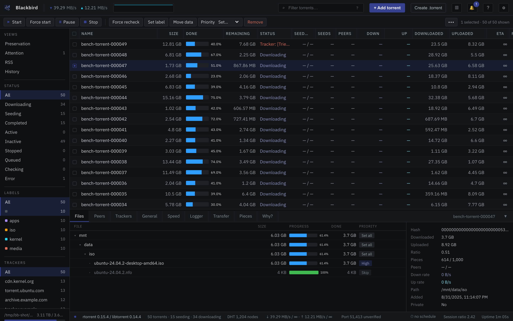

<p align="center">
  
</p>

<h1 align="center">Blackbird</h1>

<p align="center">
  A fast, self-hosted web console for rTorrent — one <code>docker compose up</code> away.
</p>

<p align="center">
  <b>Go 1.26</b> &nbsp;·&nbsp; <b>SolidJS + TypeScript</b> &nbsp;·&nbsp; <b>rTorrent 0.15.7</b> &nbsp;·&nbsp; <b>Docker Compose</b>
</p>

<p align="center">
  
</p>
<p align="center"><sub>Demo session from the bundled fake daemon — 50 synthetic torrents, no real data.</sub></p>

## At a glance

| | |
| --- | --- |
| **Backend** | Go 1.26. A single static binary that embeds the UI and drives rTorrent over SCGI / XML-RPC; live updates to the browser over WebSocket. |
| **Frontend** | SolidJS + TypeScript, built with Vite. Dark and light themes, keyboard-driven, responsive down to a phone. |
| **Daemon** | rTorrent **0.15.7** / libtorrent **0.15.7**, compiled from source with SHA-256-pinned archives. Deliberately below 0.16 — see [why](deploy/README.md#image-versions). |
| **Packaging** | Two containers on a private Compose network: Blackbird on Alpine, rTorrent on Debian bookworm-slim. rTorrent's control port is never published. |
| **Auth** | Single user, HTTP Basic, bcrypt. Credentials are generated on first start and printed once. |
| **Tests** | Go unit tests, Vitest, and a Playwright suite that drives the real binary against a deterministic fake daemon. |

## Run it

```bash
git clone <your-remote> blackbird && cd blackbird
docker compose up
```

The first run compiles rTorrent from source, so give it a few minutes. When
it's up, the terminal shows your login:

```
Username: admin
Password (save it now; it will not be shown again): KnGhICVizexnNKU4AerDhZkwcCRD_NEI
```

Open **http://localhost:8223/** and paste it in. That's the whole setup.

Prefer it in the background? `docker compose up -d`, then
`docker compose logs blackbird` shows the same password. (`docker-compose`
with a hyphen is fine as long as it's the v2 plugin underneath, which it is on
any current install; the old Python v1 can't read this file.)

## Where the data goes

By default everything lives under one directory:

```
~/Downloads/torrents/            downloaded data
~/Downloads/torrents/.session/   rTorrent's session state
```

That single directory is everything worth backing up, and because the
session is a plain folder rather than a Docker volume,
`docker compose down --volumes` can't destroy it.

To put them somewhere else, set either or both in a `.env` file at the repo
root — the same values feed both containers, so they can't drift apart:

```bash
# .env
BLACKBIRD_DOWNLOAD_DIR=/mnt/storage/torrents
RTORRENT_SESSION_DIR=/mnt/storage/rtorrent-session    # optional; defaults to <downloads>/.session
```

Then `docker compose up -d`. You don't need to create the directories; the
containers repair the ownership of anything Docker creates for them.

If you'd rather edit `docker-compose.yml` directly, the same two values are
the defaults on these lines, and they appear **twice** — once under
`rtorrent`, once under `blackbird`. Change both, or rTorrent will download
into one place while Blackbird browses another and neither will report an
error:

```yaml
source: ${BLACKBIRD_DOWNLOAD_DIR:-${HOME}/Downloads/torrents}
source: ${RTORRENT_SESSION_DIR:-${BLACKBIRD_DOWNLOAD_DIR:-${HOME}/Downloads/torrents}/.session}
```

**Moving an existing setup here:** copy the download directory (including
`.session`) to the same absolute path on the new host and start. rTorrent
resumes without rehashing as long as the data is where the session says it
is. If your old install kept the session in a Docker volume, see the
migration note in [`deploy/README.md`](deploy/README.md).

## Getting back in

The password is stored only as a hash, so it can't be shown again. If you lose
it, make a new one — this keeps every other setting as it was:

```bash
docker compose run --rm blackbird --bootstrap /config --rotate-password
```

## If your setup is different

**Your user isn't UID 1000.** Files still work, but they'll be owned by 1000
rather than you. Put your real IDs in the root `.env` and restart:

```bash
printf 'PUID=%s\nPGID=%s\n' "$(id -u)" "$(id -g)" >> .env
docker compose up -d
```

**You want different ports.** Also in the root `.env`:

```
BLACKBIRD_HTTP_PORT=9000
RTORRENT_P2P_PORT=51413
```

(`deploy/.env` is a different file — it's only for a password hash generated
on the host, and putting paths, ports, or `PUID` in it does nothing.)

## Before you open it to the network

Forward **47111** (TCP and UDP) on your router and firewall, or you'll only
ever get outbound peer connections.

Blackbird has a username and password and nothing else — plain HTTP, no rate
limiting beyond the basics. **Don't put 8223 on the internet directly.** Keep
it on your LAN, reach it over SSH or a VPN, or put a TLS reverse proxy in
front. To restrict it to the machine itself:

```yaml
# docker-compose.override.yml
services:
  blackbird:
    ports:
      - "127.0.0.1:8223:8222"
```

rTorrent's control port (5000) is never published; it stays on a private
network between the two containers.

## Things that bite

- **Run Compose as yourself, not with `sudo`.** `~` is read from the shell that
  runs it; under `sudo` your data goes to root's home.
- **Don't copy a `bin/` directory from another machine.** It's gitignored for a
  reason: those binaries are built for that machine. Nothing here needs them —
  `rm -rf bin/` if one came along.
- **Compose needs to be v2.24 or newer.** Docker's own package repository is
  always fine; a distro's `docker-compose` package may be too old. `docker
  compose version` tells you.

## More

- [Using the console](docs/user-guide.md)
- [Appliance internals](deploy/README.md) — image pinning, why rTorrent is on 0.15.x, tracker ramping, verification scripts
- [Every config key, annotated](internal/config/example.yml)
